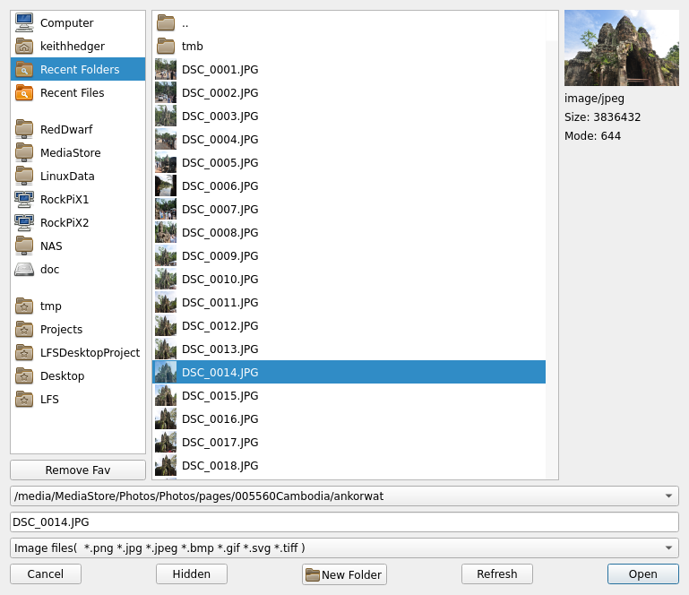

# xdg-desktop-portal-filechooser

A customizable file dialog chooser for use with xdg-desktop-portal. 



Default is to use the built in custom filed dialog, you can also select a qt filedialog, with more to come. 
####
Based on original code here:
<a href="https://github.com/capezotte/xdg-desktop-portal-scriptfm">https://github.com/capezotte/xdg-desktop-portal-scriptfm</a>
###
**Installation:**
```console
make
sudo make install

````
To select what file dialog to use create xdgfilechooser.conf in ~/.config like so:
````console
#!/bin/bash

#USEDIALOG=qtdialog
USEDIALOG=customdialog

````
Comment/uncomment your prefered filedialog
#
**To start the portal run:**
```console
SFM_FILE_SCRIPT='/usr/share/filechooserportal/xdgportalscript' '/usr/libexec/filechooser'

````
Some where in your start up scripts ( this will vary by distro, probably adding to rc.local will work fine ).
#
**TODO:**

gtk chooser.

lxqt chooser.
